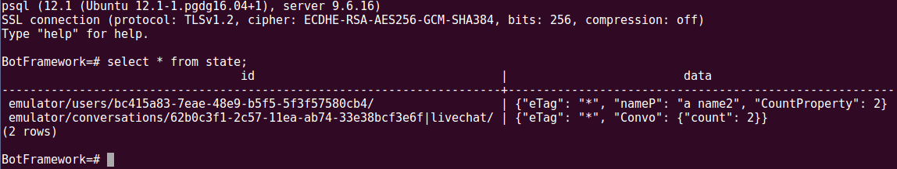

## Example bot using Postgres for Bot Framework.

### Getting Started
You need to acces to a postgres server and the url/credentials. Postgres can also be ran locally.

### Running localy (requires a Postgres server to be running)
* #### Build
  Please ensure that the root project is built by running the following commands at the root of this repo.

  Install Project Dependencies
  ``` npm install```

  Compile and build the TypeScript code
  ``` npm run build```

  Change directory to the example folder
  ``` cd example```

  Install Sample bot dependencies
  ``` npm install```

  Create the database
  ```
  sudo su - postgres

  psql

  postgres=# create database "BotFramework";
  ```

  Start the bot
  ``` node app```

### Running via Docker (will run a Postgres container)
(coming soon!)

### Interacting with the Bot via the Emulator
* Install the [Bot Framework Emulator](https://github.com/Microsoft/BotFramework-Emulator)
*  Once installed, run the program and navigate to
  ``` File --> Open Bot Configuration```
  Select the bot file in this project.
* Enter any text and notice the counter increments on the repsonse.
* 


* Open postgres and execute the following commands.

  * ``` sudo su - postgres ```

  * ``` psql -d BotFramework```

  * ``` \d states ```

  * ```sql SELECT * FROM state; ```

  * You should see two entries one for conversation state another for user state.

  * 

#### Documentation
* [BotBuilder State](https://docs.microsoft.com/en-us/azure/bot-service/bot-builder-concept-state?view=azure-bot-service-4.0)

* [Using the Emulator](https://docs.microsoft.com/en-us/azure/bot-service/bot-service-debug-emulator?view=azure-bot-service-4.0)

