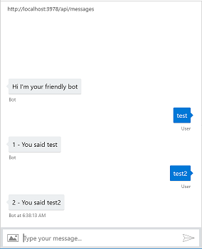
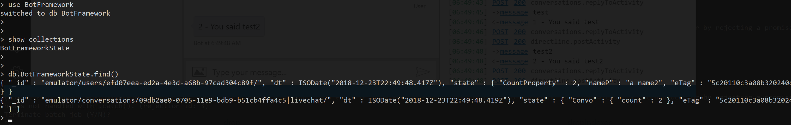

## Example bot using MongoDb Storage for Bot Framework.

### Getting Started
You need to acces to a MongoDb server and the url/credentials. MongoDb can also be ran locally. 

Alternatively, you can use Docker. See the section below for instructions on how to run this example via docker (does not require MongoDb locally and will run a mongo instance in a container.)

### Running localy (requires a MongoDb server to be running)
* #### Build
  Please ensure that the root project is built by running the following commands at the root of this repo.
  
  Install Project Dependencies
  ``` npm install```

  Compile and build the TypeScript code
  ``` npm run build```

  Change directory to the example folder
  ``` cd example```

  Install Sample bot dependencies
  ``` npm install```

  Start the bot
  ``` node app```

### Running via Docker (will run a MongoDb container)
(coming soon!)

### Interacting with the Bot via the Emulator
* Install the [Bot Framework Emulator](https://github.com/Microsoft/BotFramework-Emulator)
*  Once installed, run the program and navigate to 
  ``` File --> Open Bot Configuration```
  Select the bot file in this project.
* Enter any text and notice the counter increments on the repsonse.
* 


* Start a mongo shell session and execute the following commands.

  * ``` use botframework```

  * ``` show collections ```

  * ``` db.botframeworkstate.find() ```

  * You should see two entries one for conversation state another for user state.

  * 

#### Documentation
* [BotBuilder State](https://docs.microsoft.com/en-us/azure/bot-service/bot-builder-concept-state?view=azure-bot-service-4.0)

* [Using the Emulator](https://docs.microsoft.com/en-us/azure/bot-service/bot-service-debug-emulator?view=azure-bot-service-4.0)

